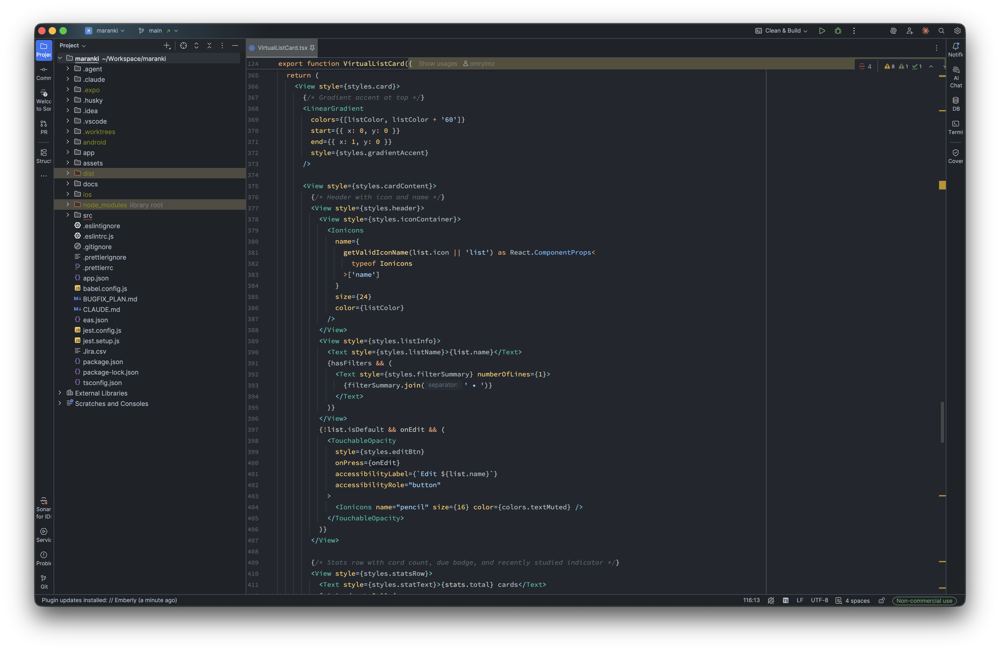
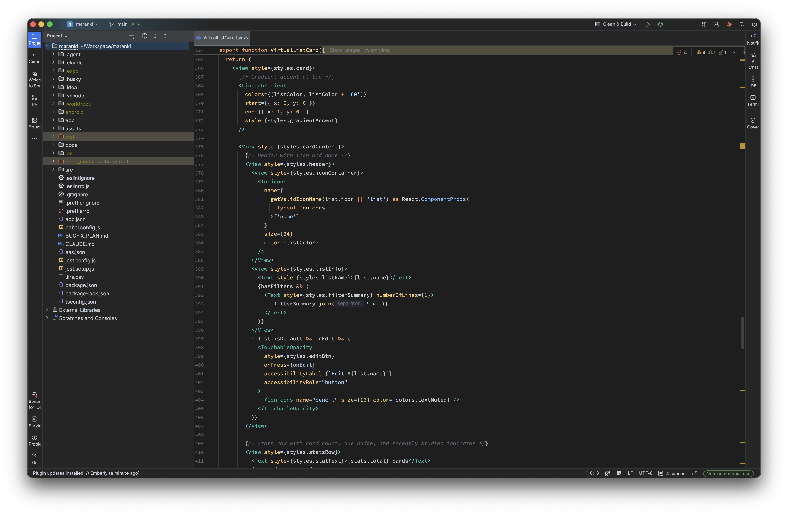
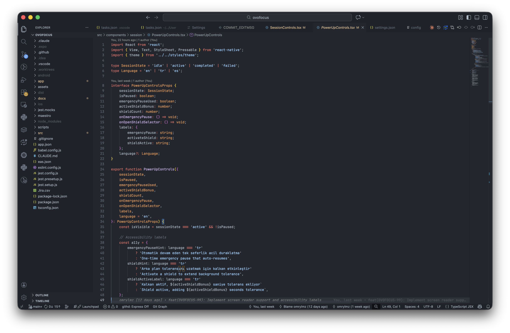
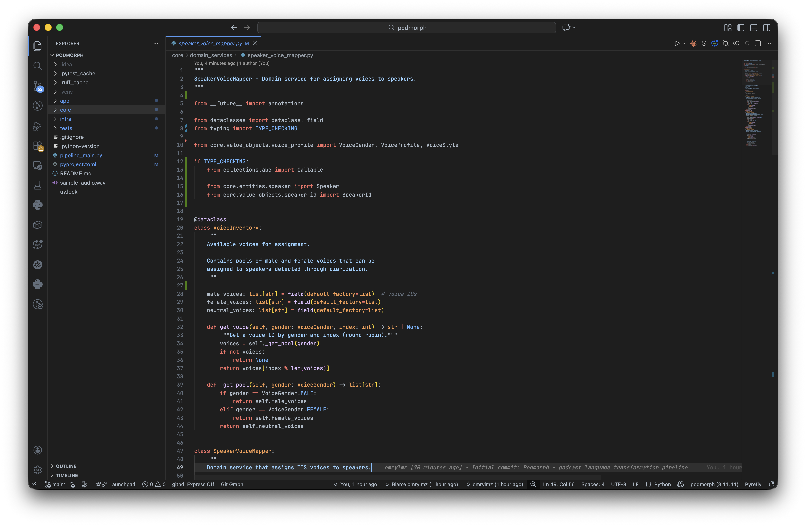
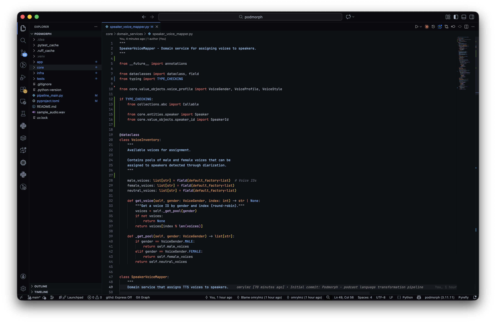

# Emberly

A dark theme collection inspired by the warm amber tones of the Rust Book documentation. Designed for long coding sessions with comfortable contrast and reduced eye strain.

If you enjoy themes like Ayu or Tomorrow, you might like Emberly.

## Variants

| Theme | Background | Best For |
|-------|------------|----------|
| **Emberly Carbon** | `#1e1e1e` | Standard dark environment |
| **Emberly Noir** | `#22272e` | Softer, slightly warmer feel |
| **Emberly Umbra** | `#0d1117` | Maximum contrast, OLED displays |

## Color Palette

### Syntax Colors
- **Keywords & Operators**: Warm orange `#FFAE57`
- **Functions**: Golden amber `#FFD580`
- **Strings**: Lime green `#BAE67E`
- **Numbers & Parameters**: Soft lavender `#D4BFFF`
- **Types & Classes**: Cyan `#5CCFE6`
- **Comments**: Muted gray `#5C6773` (italic)
- **Escape sequences**: Mint `#95E6CB`

### UI Colors
- **Text**: Warm white `#D9D7CE`
- **Caret**: Golden `#FFCC66`
- **Selection**: Deep blue `#245187`

## Installation

### JetBrains IDEs (IntelliJ, WebStorm, PyCharm, GoLand, etc.)

**Option 1: Marketplace (Recommended)**
1. Go to **Settings** → **Plugins** → **Marketplace**
2. Search for "Emberly"
3. Click **Install** and restart
4. Go to **Settings** → **Appearance** → **Theme** and select an Emberly theme

**Option 2: Manual Plugin Install**
1. Download the latest `.zip` from [Releases](https://github.com/omrylmz/emberly/releases)
2. Go to **Settings** → **Plugins** → ⚙️ → **Install Plugin from Disk**
3. Select the downloaded file and restart
4. Go to **Settings** → **Appearance** → **Theme** and select an Emberly theme

**Option 3: Color Scheme Only**
If you only want the syntax colors without the full UI theme:
1. Download the `.xml` file from `jetbrains/colors/`
2. Go to **Settings** → **Editor** → **Color Scheme**
3. Click ⚙️ → **Import Scheme**
4. Select the downloaded file

### VS Code

**Option 1: Marketplace (Recommended)**
1. Open Extensions sidebar (`Ctrl+Shift+X`)
2. Search for "Emberly"
3. Click Install
4. Select theme: `Preferences: Color Theme` → Emberly Carbon/Noir/Umbra

**Option 2: Manual Installation**
Download `.vsix` from [Releases](https://github.com/omrylmz/emberly/releases), then:
```bash
code --install-extension emberly-1.2.0.vsix
```

## Screenshots

### JetBrains

| Carbon | Noir | Umbra |
|--------|------|-------|
|  |  |  |

### VS Code

| Carbon | Noir | Umbra |
|--------|------|-------|
|  |  |  |

## License

MIT License - See [LICENSE](LICENSE) for details.

## Contributing

Contributions welcome! Feel free to:
- Report issues
- Submit pull requests
- Request additional IDE/editor support
